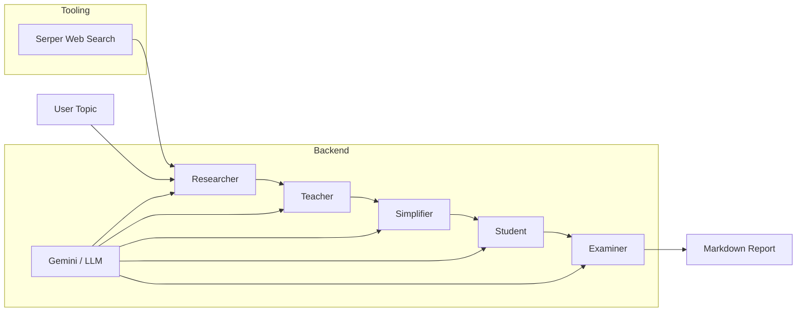

<!-- README generated for Multi-Agent Research Assistant -->

<div align="center">
  <h1>🤖 Multi-Agent Research Assistant</h1>
  <p>A fully autonomous AI research pipeline built with CrewAI that converts a single topic into structured educational content.</p>

  <p>
    <a href="#usage-examples"><strong>Usage →</strong></a>
    &nbsp;|&nbsp;
    <a href="#architecture">Architecture</a>
    &nbsp;|&nbsp;
    <a href="#features">Features</a>
  </p>
</div>

<div align="center">
  
  
  
  
  
</div>

---

## Overview

**Multi-Agent Research Assistant** is an AI-driven research automation system that orchestrates five specialized agents to transform a single topic into:

- verified research findings
- step-by-step explanation
- plain-language summary
- revision notes
- comprehension questions

The solution is designed for AI engineering, knowledge synthesis, and automated educational content generation using CrewAI and modern LLM orchestration.

## Features

- ✅ Multi-agent AI workflow with sequential task orchestration
- ✅ Autonomous research and web search integration
- ✅ Structured Markdown report generation
- ✅ Clear explanation and simplification pipeline
- ✅ Modular agent design for easy extension
- ✅ Async execution support via `main.py --async`
- ✅ Environment-driven model selection and configuration
- ✅ Clean output ready for documentation or learning use cases

## Architecture

This repository uses a sequential CrewAI pipeline with five purpose-built agents.



### Agent responsibilities

| Agent | Responsibility | Output |
|---|---|---|
| Researcher | Search the web and compile credible findings | 3 research summaries + source references |
| Teacher | Explain concepts step-by-step with examples | structured explanation |
| Simplifier | Rewrite complex ideas in plain language | simplified summary |
| Student | Create concise revision notes | bullet-point notes |
| Examiner | Produce comprehension questions | 3 test-style questions |

## Tech Stack

| Layer | Technology |
|---|---|
| Language | Python 3.11+ |
| Agent framework | CrewAI |
| LLM tooling | `crewai`, `crewai-tools` |
| Model backend | Google Gemini |
| Search integration | Serper API |
| Configuration | `python-dotenv` |
| Output format | Markdown |

## Project Structure

```text
multi-agent-research-assistant/
├── agents/          # Agent definitions and role-specific behavior
├── tasks/           # Task payloads and instruction definitions
├── tools/           # Web search and tool integration wrappers
├── outputs/         # Generated reports
├── config.py        # LLM and environment config
├── crew.py          # CrewAI pipeline assembly
├── main.py          # CLI entrypoint
├── requirements.txt # Dependencies
└── README.md        # Project documentation
```

## Installation

```bash
git clone https://github.com/your-username/multi-agent-research-assistant.git
cd multi-agent-research-assistant
python -m pip install -r requirements.txt
```

## Environment Variables

Create a `.env` file in the repository root and configure your API keys:

```env
GEMINI_API_KEY=your_gemini_api_key_here
SERPER_API_KEY=your_serper_api_key_here
LLM_MODEL=gemini/gemini-2.5-flash
```

> `LLM_MODEL` is optional. If omitted, the project uses the default model configured in `config.py`.

## Usage Examples

Run the assistant with a custom research topic:

```bash
python main.py --topic "Impact of Agentic AI on Software Engineering"
```

Run in asynchronous mode:

```bash
python main.py --topic "Future of AI in Healthcare" --async
```

## Sample Output

The system generates a Markdown report in `outputs/` with the following sections:

- Topic header and timestamp
- Research findings with source references
- Detailed explanation of the topic
- Plain-language summary
- Revision notes
- Exam-style questions

Example generated file:

```text
outputs/report_20260101_120000.md
```

## Customization Guide

### Change the LLM backend

Update `LLM_MODEL` in `.env` or change `DEFAULT_LLM` in `config.py`.

### Add tools

Add a new tool wrapper in `tools/` and attach it to the relevant agent in `agents/*.py`.

### Extend the pipeline

Modify `crew.py` to reorder agents or add new task stages.

## Future Enhancements

- [ ] Add PDF / DOCX export for generated reports
- [ ] Add a web dashboard or Streamlit UI
- [ ] Support additional search sources and scraping tools
- [ ] Add a Critique / Review agent for quality validation
- [ ] Add logging and analytics for agent performance

## Contributing

Contributions are welcome! Please follow these steps:

1. Fork the repository
2. Create a feature branch
3. Submit a pull request with a clear description

## License

Released under the MIT License.

## Author

**Ramchand Sevaiwar**  
AI Engineer · AI Research Automation · Open Source Enthusiast

---

## ⭐ If you found this project useful

Give it a star on GitHub and share it with the AI engineering community.
