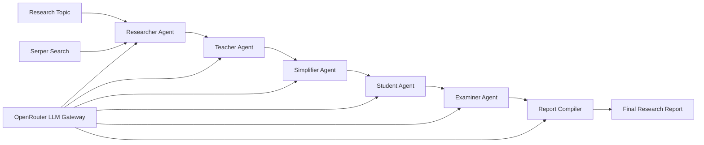
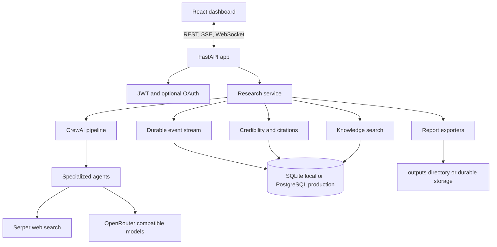

# Multi-Agent Research Assistant

<p align="center">
  <strong>ResearchOS is a production-ready multi-agent research workspace that turns a topic into a sourced, structured, exportable intelligence report.</strong>
</p>

<p align="center">
  <a href="https://multi-agent-research-assistant-xjo8.onrender.com/">Live App</a>
  &nbsp;|&nbsp;
  <a href="https://multi-agent-research-assistant-xjo8.onrender.com/docs">API Docs</a>
  &nbsp;|&nbsp;
  <a href="https://multi-agent-research-assistant-xjo8.onrender.com/health">Health Check</a>
  &nbsp;|&nbsp;
  <a href="docs/ARCHITECTURE.md">Architecture</a>
  &nbsp;|&nbsp;
  <a href="docs/DEPLOYMENT.md">Deployment</a>
</p>

<p align="center">
  <a href="https://docs.python.org/3/"></a>
  <a href="https://fastapi.tiangolo.com/"></a>
  <a href="https://docs.crewai.com/"></a>
  <a href="https://docs.crewai.com/tools/overview"></a>
  <a href="https://openrouter.ai/docs"></a>
  <a href="https://serper.dev/"></a>
  <a href="https://react.dev/"></a>
  <a href="https://vite.dev/guide/"></a>
  <a href="https://www.uvicorn.org/"></a>
  <a href="https://docs.sqlalchemy.org/"></a>
  <a href="https://www.postgresql.org/docs/"></a>
  <a href="https://www.sqlite.org/docs.html"></a>
  <a href="https://www.docker.com/get-started/"></a>
  <a href="https://render.com/docs"></a>
</p>

<p align="center">
  <a href="https://github.com/openai/openai-python"></a>
  <a href="https://www.python-httpx.org/"></a>
  <a href="https://pyjwt.readthedocs.io/"></a>
  <a href="https://saurabh-kumar.com/python-dotenv/"></a>
  <a href="https://docs.reportlab.com/"></a>
  <a href="https://python-markdown.github.io/"></a>
  <a href="https://python-docx.readthedocs.io/"></a>
  <a href="https://docs.pytest.org/"></a>
  <a href="https://docs.astral.sh/ruff/"></a>
</p>

All library badges above link directly to the relevant documentation.

## Overview

Multi-Agent Research Assistant, branded in the app as ResearchOS, coordinates a sequential CrewAI pipeline for research, explanation, simplification, revision notes, assessment, and final report compilation.

It is built as a full-stack platform, not only a script:

- FastAPI backend with versioned REST endpoints, SSE streams, WebSocket events, auth, exports, analytics, and OpenAPI docs.
- React and Vite dashboard for running research, watching agents live, browsing the report library, searching memory, and tuning configuration.
- SQLAlchemy persistence with SQLite for local development and PostgreSQL for production.
- Docker, Docker Compose, and Render Blueprint deployment support.
- CLI compatibility for direct terminal report generation.

## Live Deployment

The hosted Render deployment is available at:

```text
https://multi-agent-research-assistant-xjo8.onrender.com/
```

Useful production URLs:

| Resource | URL |
|---|---|
| Dashboard | https://multi-agent-research-assistant-xjo8.onrender.com/ |
| Swagger API docs | https://multi-agent-research-assistant-xjo8.onrender.com/docs |
| ReDoc | https://multi-agent-research-assistant-xjo8.onrender.com/redoc |
| Health check | https://multi-agent-research-assistant-xjo8.onrender.com/health |

Render free-tier services can cold start after inactivity. The first request may take longer while the container wakes up.

## Core Capabilities

| Capability | What it does |
|---|---|
| Multi-agent research pipeline | Runs researcher, teacher, simplifier, student, examiner, and reporter agents in order. |
| Live execution monitoring | Streams durable progress through SSE and WebSocket endpoints. |
| Source scoring | Deduplicates URLs and ranks source credibility with explainable scores. |
| Research library | Stores completed reports, events, sources, citations, and metadata. |
| Knowledge base | Chunks completed reports and supports semantic-style retrieval over prior work. |
| Export pipeline | Generates PDF, DOCX, HTML, Markdown, JSON, CSV, and ZIP artifacts. |
| Agent playground | Runs individual agents against custom context for prompt testing. |
| Auth ready | Supports JWT login/register and optional Google/GitHub OAuth configuration. |
| Production deployment | Ships with Docker, Compose, Render Blueprint, and AWS deployment docs. |

## Agent Workflow



The pipeline is sequential by design. Each agent receives the previous stage's output so the final report keeps context instead of producing disconnected sections.

## Architecture



## Project Structure

```text
multi-agent-research-assistant/
|-- app/                         # Production FastAPI application package
|   |-- core/                    # Settings, security, logging
|   |-- database/                # SQLAlchemy models and repository boundary
|   |-- models/                  # Pydantic request/response schemas
|   `-- services/                # Research, events, exports, citations, memory
|-- agents/                      # CrewAI agent definitions
|-- tasks/                       # CrewAI task definitions
|-- tools/                       # Tool wrappers such as search integration
|-- backend/
|   `-- api.py                   # ASGI compatibility entrypoint
|-- frontend/                    # React/Vite dashboard
|   |-- src/                     # UI source
|   |-- package.json             # Frontend scripts and dependencies
|   `-- vite.config.js           # Local dev proxy to FastAPI
|-- docs/                        # Architecture, API, deployment, roadmap docs
|-- tests/                       # API, database, and service tests
|-- aws/                         # AWS deployment artifacts
|-- data/                        # Local runtime database; ignored in production
|-- logs/                        # Runtime logs; ignored in production
|-- outputs/                     # Generated reports; sample report is kept
|-- config.py                    # LLM/provider configuration for the agent pipeline
|-- crew.py                      # CrewAI composition root
|-- main.py                      # CLI runner
|-- Dockerfile                   # Multi-stage frontend/backend image
|-- docker-compose.yml           # Local production-like stack
|-- render.yaml                  # Render Blueprint
|-- pyproject.toml               # Python package metadata and dev tooling
|-- requirements.txt             # Runtime Python dependencies
`-- README.md                    # Project documentation
```

Runtime artifacts such as `frontend/node_modules/`, `frontend/dist/`, `data/*.db`, `logs/`, and generated files under `outputs/` should not be treated as source code. Keep the repository focused on application code, infrastructure definitions, tests, and documentation.

## Prerequisites

- Python 3.10 or newer
- Node.js 20 or newer
- Docker Desktop, if using containers
- OpenRouter API key
- Serper API key

## Environment Variables

Copy `.env.example` to `.env` and configure the values below.

| Variable | Required | Purpose |
|---|---:|---|
| `OPENROUTER_API_KEY` | Yes | LLM provider key used by the CrewAI pipeline. |
| `SERPER_API_KEY` | Yes | Web search key for the researcher agent. |
| `DEFAULT_LLM` | No | Default OpenRouter model. |
| `FALLBACK_LLM` | No | Optional fallback model. |
| `DATABASE_URL` | No | Defaults to local SQLite; use PostgreSQL in production. |
| `JWT_SECRET` | Yes in production | Secret used for access tokens. |
| `AUTH_REQUIRED` | No | Set `true` to require authenticated API access. |
| `CORS_ORIGINS` | No | Comma-separated allowed frontend origins. |
| `NUMBER_OF_SOURCES` | No | Search/source count per research run. |
| `REQUEST_TIMEOUT` | No | Provider timeout in seconds. |
| `VECTOR_DB` | No | Local by default; optional vector provider name. |
| `GOOGLE_CLIENT_ID` / `GOOGLE_CLIENT_SECRET` | No | Enables Google OAuth when both are present. |
| `GITHUB_CLIENT_ID` / `GITHUB_CLIENT_SECRET` | No | Enables GitHub OAuth when both are present. |

## Local Development

Install the Python package and developer tools:

```bash
python -m venv .venv
python -m pip install --upgrade pip
python -m pip install -e ".[dev]"
cp .env.example .env
```

On Windows PowerShell, activate the virtual environment with:

```powershell
.\.venv\Scripts\Activate.ps1
```

Start the API:

```bash
uvicorn backend.api:app --reload --host 0.0.0.0 --port 8000
```

Start the frontend in a second terminal:

```bash
cd frontend
npm install
npm run dev
```

Open the local dashboard:

```text
http://localhost:4173
```

Vite proxies `/api` requests to `http://127.0.0.1:8000`, so the frontend can call the API with relative paths during development.

## CLI Usage

The original CLI workflow is still available:

```bash
python main.py --topic "How are small language models changing edge computing?"
```

Async mode:

```bash
python main.py --topic "What evidence exists for a four-day work week?" --async
```

CLI reports are written to `outputs/` as Markdown, structured text, and PDF files.

## Docker Compose

Run the production-like local stack:

```bash
cp .env.example .env
docker compose up --build
```

Compose starts:

- FastAPI and the built React dashboard on `http://localhost:8000`
- PostgreSQL for durable application data
- Named volumes for reports and logs
- Optional Qdrant profile for vector storage experiments

To enable Qdrant:

```bash
docker compose --profile qdrant up --build
```

## Render Deployment

The repository includes `render.yaml` for a Render Blueprint deployment.

1. Open the Render Blueprint:
   `https://render.com/deploy?repo=https://github.com/Ram2002-ai/multi-agent-research-assistant`
2. Connect the repository.
3. Set `OPENROUTER_API_KEY` and `SERPER_API_KEY`.
4. Deploy the Docker web service and managed PostgreSQL database.
5. Verify `/health`, then open the dashboard root URL.

Render wires `DATABASE_URL` from the managed database and generates `JWT_SECRET`. Set `AUTH_REQUIRED=true` before sharing a public deployment if anonymous research should not be allowed.

## API Surface

Interactive API documentation is served by FastAPI at `/docs`.

| Method | Path | Purpose |
|---|---|---|
| `GET` | `/health` | Service health and runtime metadata. |
| `POST` | `/research` | Legacy blocking research endpoint. |
| `POST` | `/api/v1/research` | Start a background research job. |
| `GET` | `/api/v1/research/{job_id}` | Read job status and report metadata. |
| `GET` | `/api/v1/research/{job_id}/events` | Subscribe to SSE job events. |
| `WS` | `/api/v1/research/{job_id}/ws` | Subscribe to WebSocket job events. |
| `GET` | `/api/v1/reports` | List and search report history. |
| `GET` | `/api/v1/reports/{report_id}` | Fetch report, events, sources, citations, and graph. |
| `GET` | `/api/v1/reports/{report_id}/export/{format}` | Export a report artifact. |
| `POST` | `/api/v1/knowledge/search` | Search prior report memory. |
| `GET` | `/api/v1/analytics` | Read aggregate platform metrics. |
| `GET` / `PUT` | `/api/v1/config` | Read or update user research settings. |
| `GET` / `POST` | `/api/v1/prompts` | Manage prompt templates. |
| `POST` | `/api/v1/playground` | Run one specialist agent directly. |
| `POST` | `/api/v1/auth/register` | Create a local account. |
| `POST` | `/api/v1/auth/login` | Issue a JWT access token. |

Example:

```bash
curl -X POST http://localhost:8000/api/v1/research \
  -H "Content-Type: application/json" \
  -d "{\"topic\":\"How will solid-state batteries affect aviation?\"}"
```

## Testing And Quality

Run backend tests:

```bash
pytest
```

Run linting:

```bash
ruff check .
```

Build the frontend:

```bash
cd frontend
npm run build
```

Recommended release checks before deployment:

- `pytest`
- `ruff check .`
- `npm run build` from `frontend/`
- Docker image build through `docker compose up --build`
- `/health` and `/docs` smoke checks after deployment

## Documentation Map

| Document | Purpose |
|---|---|
| `docs/ARCHITECTURE.md` | System design, lifecycle, and package boundaries. |
| `docs/API_GUIDE.md` | API usage examples and endpoint reference. |
| `docs/DEPLOYMENT.md` | Render, Docker Compose, production checklist, OAuth callbacks. |
| `docs/AWS_DEPLOYMENT.md` | AWS deployment path using ECR/ECS and related infrastructure. |
| `docs/DEVELOPMENT.md` | Local development workflow. |
| `docs/PROMPTS.md` | Prompt management and agent prompt workflow. |
| `docs/ROADMAP.md` | Planned improvements. |
| `PDF_OUTPUT_GUIDE.md` | PDF export behavior and formatting notes. |

## Production Notes

- Use PostgreSQL for deployed environments. SQLite is intended for local single-node development.
- Keep `JWT_SECRET` long, random, and stored in the platform secret manager.
- Restrict `CORS_ORIGINS` to trusted frontend origins.
- Enable `AUTH_REQUIRED=true` for public deployments unless open access is intentional.
- Render's filesystem is ephemeral. Use a persistent disk or object storage for long-lived downloadable artifacts.
- Horizontal scaling should move active research jobs to a worker queue and stream events through a shared broker.
- Add provider budgets and request quotas before exposing the app to untrusted traffic.

## Contributing

1. Create a feature branch.
2. Keep changes scoped and covered by tests where behavior changes.
3. Run the quality checks above.
4. Open a pull request with context, screenshots for UI changes, and deployment notes when relevant.

## License

No license file is currently included in this repository. Add a `LICENSE` file before publishing or distributing the project as open source.

## Author

Built and maintained by Ramchand Sevaiwar.
