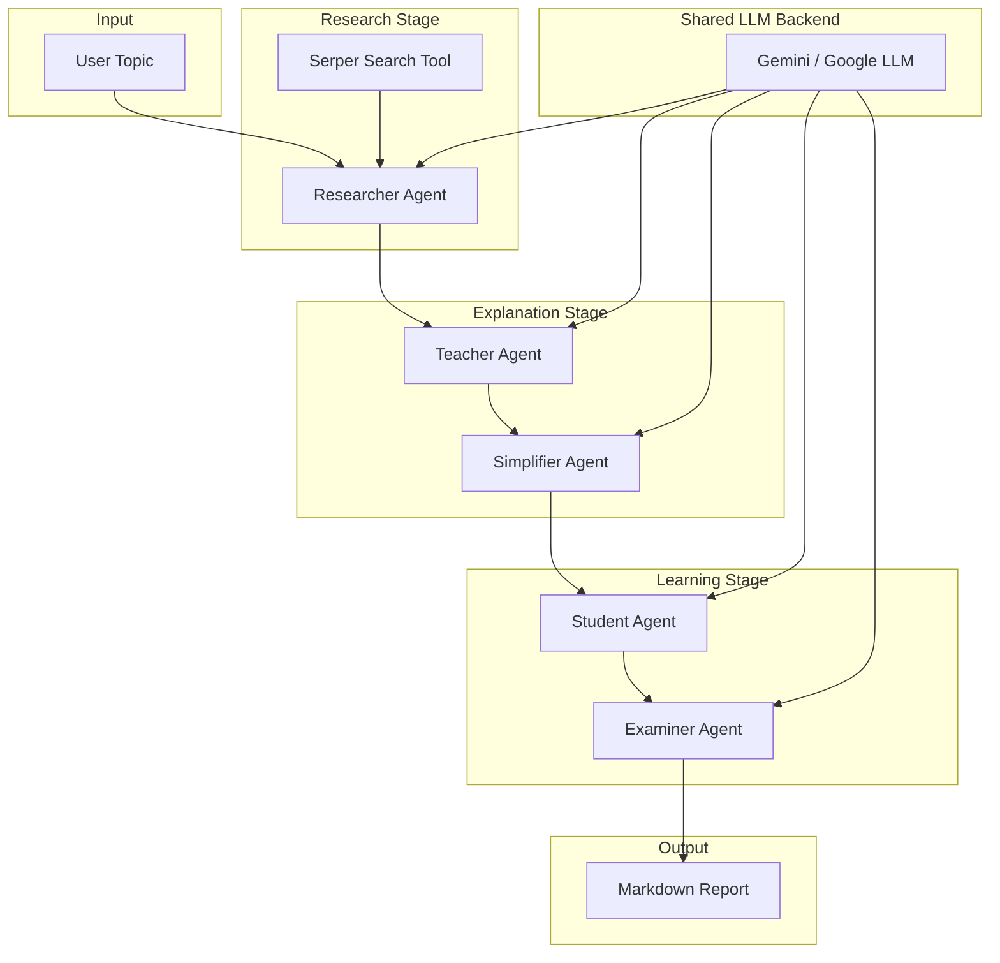

<!-- README generated for Multi-Agent Research Assistant -->

<div align="center">
  <h1>🤖 Multi-Agent Research Assistant</h1>
  <p><strong>AI-powered research automation for structured learning, knowledge synthesis, and educational content generation.</strong></p>

  <p>
    <a href="#overview"><strong>Overview</strong></a>
    &nbsp;|&nbsp;
    <a href="#architecture"><strong>Architecture</strong></a>
    &nbsp;|&nbsp;
    <a href="#usage-examples"><strong>Usage</strong></a>
    &nbsp;|&nbsp;
    <a href="#contributing"><strong>Contributing</strong></a>
  </p>
</div>

<div align="center">
  
  
  
  
  
</div>

---

## Overview

**Multi-Agent Research Assistant** is a professional AI engineering project that orchestrates a chain of autonomous agents to transform a topic into high-value educational content.

It is ideal for:

- AI researchers who want automated topic synthesis
- Educators building concise learning materials
- Technical teams validating research pipelines
- Recruiters and hiring managers evaluating AI product readiness

### What it delivers

- research findings with source references
- step-by-step topic explanations
- plain-language summaries
- structured revision notes
- exam-style questions

---

## Why this project matters

This project demonstrates how agentic AI and CrewAI can be used for real-world knowledge automation. It moves beyond simple generation by building a policy-driven workflow, where each agent has a distinct role, memory context, and output responsibility.

---

## Core Workflow

1. **Researcher**: searches the web, evaluates sources, and summarizes findings.
2. **Teacher**: explains the topic in a structured, contextual manner.
3. **Simplifier**: rewrites the explanation in plain, accessible language.
4. **Student**: distills the content into concise revision notes.
5. **Examiner**: generates comprehension questions for assessment.

---

## Architecture



<details>
<summary><strong>Interactive Workflow Summary</strong></summary>

- **Sequential pipeline**: each agent builds on prior outputs
- **Shared context**: all agents access the evolving narrative
- **Tool access**: only the Researcher uses external search
- **Structured output**: final Markdown report ready for publication

</details>

---

## Features

| Capability | Benefit |
|---|---|
| Multi-Agent Workflow | Clear separation of research, explanation, simplification, and evaluation |
| Autonomous Search | Uses Serper API to gather real-world information |
| Markdown Reports | Output is portable, readable, and GitHub-friendly |
| Agent Memory | Shared context improves continuity across stages |
| Async Execution | Supports faster runs with optional async mode |
| Modular Design | Easy to extend with new agents, tools, and workflows |

---

## Tech Stack

| Layer | Technology |
|---|---|
| Language | Python 3.11+ |
| Agent Orchestration | CrewAI |
| Tooling | CrewAI Tools, Serper API |
| LLM Backend | Google Gemini via `google-generativeai` |
| Config | `python-dotenv` |
| Output | Markdown Reports |

---

## Project Structure

```text
multi-agent-research-assistant/
├── agents/          # Agent role definitions and prompts
├── tasks/           # Task objects and instructions
├── tools/           # Tool wrappers (search, utilities)
├── outputs/         # Generated Markdown reports
├── config.py        # Environment and LLM configuration
├── crew.py          # Pipeline assembly and crew orchestration
├── main.py          # CLI entrypoint and runner
├── requirements.txt # Dependencies
└── README.md        # Project documentation
```

---

## Installation

```bash
git clone https://github.com/your-username/multi-agent-research-assistant.git
cd multi-agent-research-assistant
python -m pip install -r requirements.txt
```

---

## Environment Configuration

Create a `.env` file and add your API credentials:

```env
GEMINI_API_KEY=your_gemini_api_key_here
SERPER_API_KEY=your_serper_api_key_here
LLM_MODEL=gemini/gemini-2.5-flash
```

> `LLM_MODEL` is optional and can override the default backend configured in `config.py`.

---

## Usage Examples

### Run the research assistant

```bash
python main.py --topic "Impact of Agentic AI on Software Engineering"
```

### Run in async mode

```bash
python main.py --topic "Future of AI in Healthcare" --async
```

### Expected output

A Markdown report is saved under `outputs/`, e.g.:

```text
outputs/report_20260101_120000.md
```

---

## Sample Output Structure

- **Topic header**
- **Generated timestamp**
- **Research findings**
- **Detailed explanation**
- **Plain-language summary**
- **Revision notes**
- **Exam-style questions**

---

## Agent Responsibilities

| Agent | Role | Why it matters |
|---|---|---|
| Researcher | Gathering and validating source data | Ensures factual grounding and credible context |
| Teacher | Translating research into structured explanation | Makes the subject understandable and actionable |
| Simplifier | Converting explanation into plain language | Increases accessibility for non-experts |
| Student | Distilling learning into notes | Supports quick revision and retention |
| Examiner | Generating assessment questions | Validates comprehension and knowledge transfer |

---

## Customization Guide

### Change the LLM backend

- Edit `LLM_MODEL` in `.env`
- Or update `DEFAULT_LLM` in `config.py`

### Add a new tool

1. Create a new tool in `tools/`
2. Import it in the target agent module
3. Attach it in the agent factory

### Extend the workflow

- Update `crew.py` to add or reorder agents
- Add new task definitions in `tasks/`
- Maintain the sequential shared context model for best results

---

## Future Roadmap

- [ ] Add export options for PDF and DOCX
- [ ] Build a web dashboard or Streamlit UI
- [ ] Add a validation/review agent for quality assurance
- [ ] Support additional search and scraping sources
- [ ] Add performance logging and audit trails

---

## Contributing

This project welcomes contributions from AI engineers, open source developers, and technical writers.

1. Fork the repo
2. Create a feature branch
3. Open a pull request with context and tests

---

## License

MIT License

---

## Author

**Ramchand Sevaiwar**  
AI Engineer · Research Automation · Open Source Maintainer

---

## ⭐ Star this repository

If this project helped you, please star it and share it with your network.
