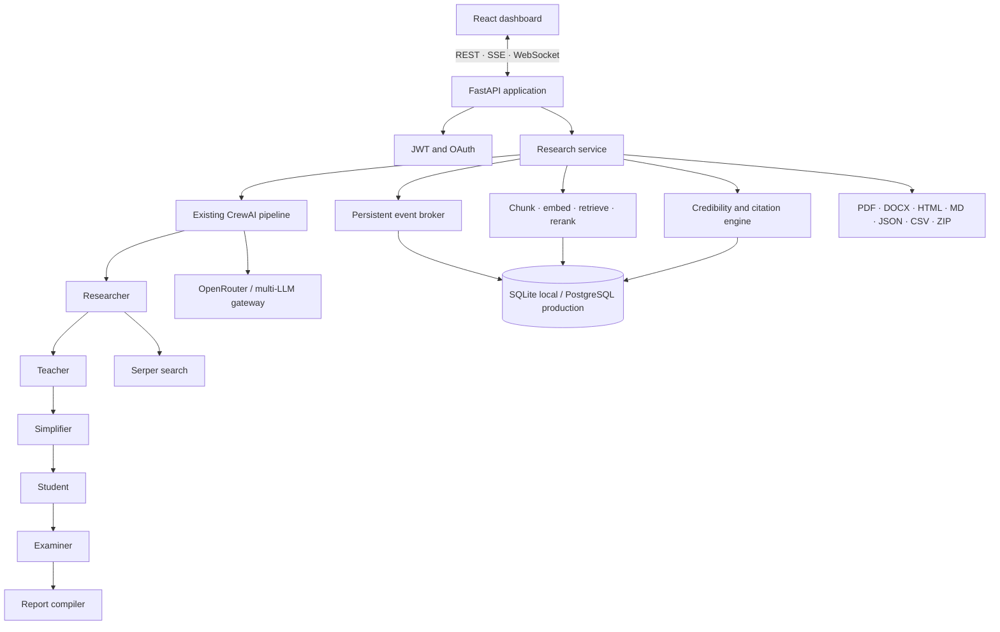

# ResearchOS architecture

ResearchOS extends the original CrewAI application rather than replacing it.
`build_crew(topic)` remains the composition root for the agent pipeline, and
`POST /research` retains its original blocking response.

## Execution lifecycle

1. The API creates a durable report record and returns a job ID.
2. The research service starts the existing sequential CrewAI crew.
3. CrewAI task and step callbacks produce agent, log, progress, retry, and
   checkpoint events.
4. Events are written before being broadcast to SSE and WebSocket subscribers.
5. Once the crew finishes, source URLs are deduplicated and scored.
6. Report chunks are embedded and stored in long-term memory.
7. The Markdown artifact is generated and the job becomes `completed`.
8. Other export formats are generated on demand.

The reasoning agents remain sequential because each consumes the preceding
agent's output. Independent post-processing (persistence, scoring, retrieval,
and client delivery) is asynchronous.

## Package responsibilities

| Package | Responsibility |
|---|---|
| `agents/`, `tasks/`, `crew.py` | Original agent roles and flow |
| `app/core` | Settings, secrets, security, structured logging |
| `app/database` | SQLAlchemy models and repository boundary |
| `app/services/research.py` | Orchestration, retries, checkpoints, metrics |
| `app/services/events.py` | Durable SSE/WebSocket pub/sub |
| `app/services/knowledge.py` | Local vector memory and reranking |
| `app/services/credibility.py` | Explainable source scoring |
| `app/services/exporters.py` | Publication artifacts |
| `app/factory.py` | API composition and compatibility routes |
| `frontend/` | Responsive React control plane |

## Production boundaries

- API nodes are stateless except for active in-process jobs. For horizontal
  scaling, move job execution to a worker queue and broker events through
  Redis or PostgreSQL LISTEN/NOTIFY.
- Files are local by default. Mount durable storage or replace the exporter
  target with S3-compatible object storage.
- SQLite is for one-node development. PostgreSQL is the Compose and production
  target.
- The included hashing embedder is deterministic and offline. The vector-store
  interface is ready for a managed embedding and vector provider when scale or
  retrieval quality calls for it.
